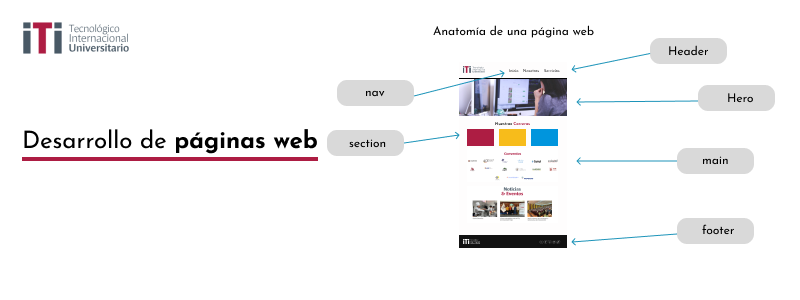

En el mundo del desarrollo de páginas web. En la era digital actual, las páginas web son una parte fundamental de la presencia en línea de cualquier empresa, organización o individuo. En esta presentación, exploraremos los aspectos clave del desarrollo de páginas web, desde los conceptos básicos hasta las últimas tendencias y tecnologías.

### Aspectos clave del desarrollo web:

+ ***Diseño web***: El diseño web es la primera impresión que los visitantes tienen de un sitio. Implica la creación de diseños atractivos y funcionales que se adapten a las necesidades y la identidad de la marca.

+ ***Desarrollo front-end***: Esta parte del desarrollo web se enfoca en la creación de la parte visible de un sitio web. Se utiliza HTML, CSS y JavaScript para construir la estructura, el diseño y la interactividad de las páginas web.

+ ***Desarrollo back-end***: El desarrollo back-end se encarga de la lógica y la funcionalidad detrás de escena de un sitio web. Se utilizan lenguajes de programación como PHP, Python o Ruby para gestionar bases de datos, autenticación de usuarios y procesamiento de datos.

+ ***Seguridad web***: La seguridad web es crítica para proteger los datos y la privacidad de los usuarios. Se deben implementar prácticas de seguridad como HTTPS y protección contra ataques.

### HTML
Hyper text markup language
Permite la estructuración, esqueleto o maquetación semantica.

